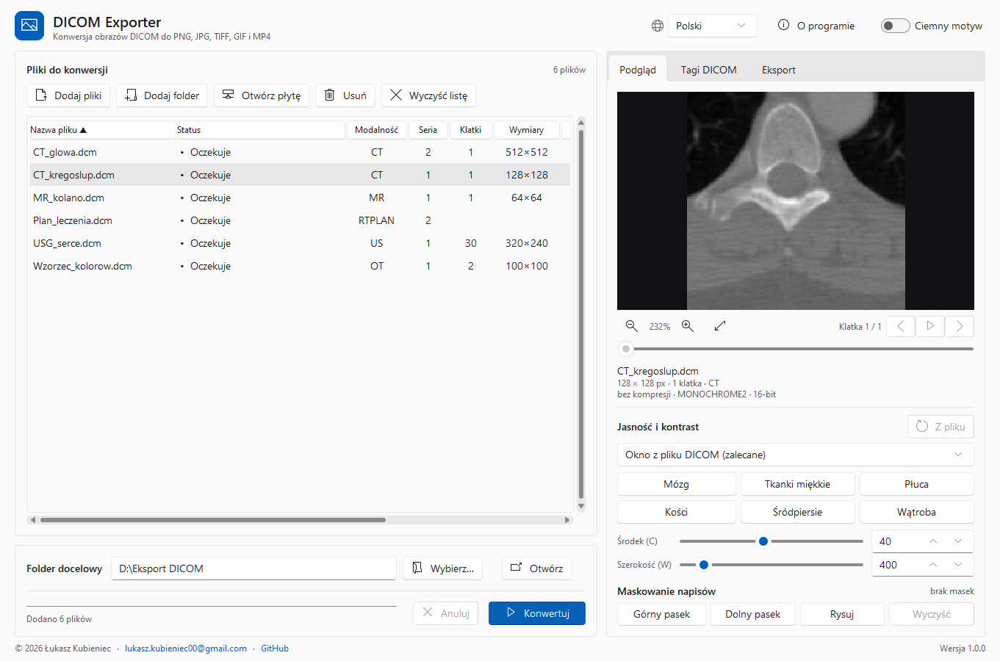
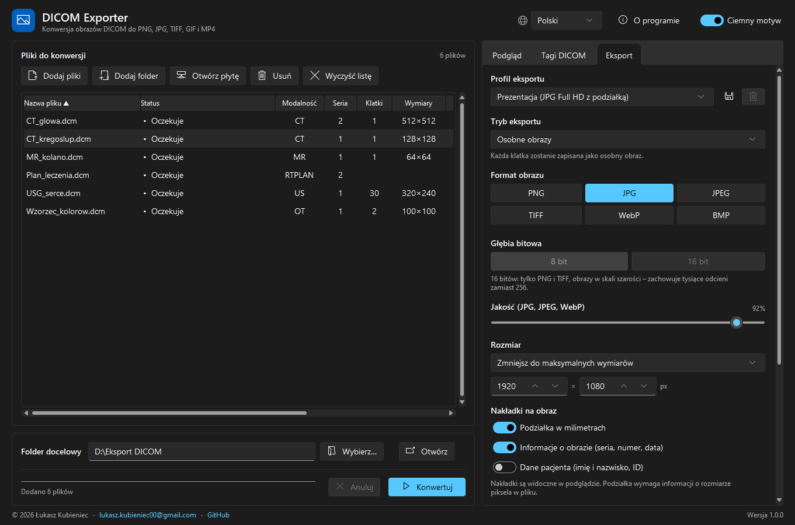
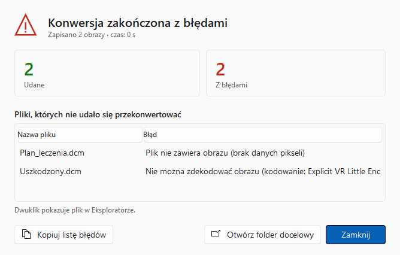

# DICOM Exporter

**Konwersja obrazów medycznych DICOM do zwykłych obrazów, animacji i wideo – bez instalacji.**

DICOM Exporter zamienia pliki DICOM (np. z płyty z badaniem tomografii, rezonansu, RTG czy USG) na **PNG, JPG,
TIFF, WebP lub BMP**. Całą serię obrazów zapisze też jako **animację GIF, wideo MP4 albo kolaż miniatur**,
a do publikacji czy nauki przygotuje **anonimizowane kopie DICOM**. Działa na pojedynczych plikach i na tysiącach
naraz. Interfejs po polsku i angielsku.

### ⬇️ [Pobierz najnowszą wersję](https://github.com/facior/DicomExporter/releases/latest)



---

## Spis treści

- [Pobieranie i uruchomienie](#pobieranie-i-uruchomienie)
- [Szybki start](#szybki-start)
- [Jak to zrobić?](#jak-to-zrobić)
- [Skróty klawiszowe](#skróty-klawiszowe)
- [Wiersz poleceń](#wiersz-poleceń)
- [Rozwiązywanie problemów](#rozwiązywanie-problemów)
- [Prywatność i zastrzeżenia](#prywatność-i-zastrzeżenia)
- [Dla programistów](#dla-programistów)

## Pobieranie i uruchomienie

Wymagania: **Windows 10 lub 11 (64-bit)**. Nie trzeba niczego instalować.

Na stronie [Releases](https://github.com/facior/DicomExporter/releases/latest) wybierz jeden z plików:

| Plik | Dla kogo |
| --- | --- |
| **`DicomExporter-X.Y.Z.exe`** | Najprościej: jeden plik – pobierz i kliknij dwukrotnie. Aktualizuje się sam jednym kliknięciem. Przy każdym starcie rozpakowuje się przez kilka sekund (widać wtedy ekran startowy). |
| **`DicomExporter-X.Y.Z-portable.zip`** | Szybszy start: rozpakuj folder i uruchom `DicomExporter.exe`. W środku jest też `dicom-exporter-cli.exe` do [wiersza poleceń](#wiersz-poleceń). Nowe wersje pobiera się ręcznie. |

> **Ostrzeżenie Windows SmartScreen?** Program nie jest podpisany płatnym certyfikatem, dlatego przy pierwszym
> uruchomieniu Windows może wyświetlić komunikat „System Windows ochronił ten komputer”. Kliknij
> **„Więcej informacji”**, a potem **„Uruchom mimo to”**.

### Aktualizacje

Program sam sprawdza przy starcie, czy na GitHubie jest nowsza wersja. Jeśli tak, pokaże okno z opisem zmian:

- **Zaktualizuj teraz** pobiera nową wersję, sprawdza jej sumę kontrolną, podmienia plik programu i uruchamia go
  ponownie – ustawienia i profile zostają. Stary plik jest usuwany automatycznie.
- **Później** zamyka okno; do aktualizacji wrócisz linkiem **Dostępna nowa wersja…** w prawym dolnym rogu okna.

W wersji ZIP okno prowadzi do strony pobierania. Ręcznie sprawdzisz aktualizacje w oknie **O programie** →
**Sprawdź teraz**; tam też wyłączysz automatyczne sprawdzanie.

## Szybki start

1. **Dodaj pliki** – przeciągnij pliki lub cały folder do okna albo użyj przycisków **Dodaj pliki** / **Dodaj folder**.
   Pliki DICOM często nie mają rozszerzenia (np. `IM00001`) – program rozpozna je sam, a inne pliki pominie.
2. **Sprawdź podgląd** – kliknij plik na liście, aby zobaczyć obraz po prawej stronie.
3. **Wybierz folder docelowy** – na dole okna, przycisk **Wybierz…**.
4. Kliknij **Konwertuj**. Postęp widać na pasku i na ikonie programu na pasku zadań, a wynik każdego pliku –
   w kolumnie **Status**. Na koniec pojawi się [podsumowanie](#podsumowanie-konwersji): ile plików się udało,
   a które mają błędy i dlaczego.
5. **Otwórz** wyniki przyciskiem **Otwórz folder docelowy** w podsumowaniu albo dwuklikiem na przekonwertowanym pliku.

Domyślnie powstają obrazy PNG z jasnością i kontrastem zapisanymi w pliku przez aparat – to zwykle najlepszy wybór.
Wszystkie ustawienia są zapamiętywane do następnego uruchomienia.

## Jak to zrobić?

### Płyta z badaniem (DICOMDIR)

Płyty z badaniami zawierają plik `DICOMDIR` ze spisem pacjentów, badań i serii. Kliknij **Otwórz płytę** i wskaż ten
plik (albo po prostu dodaj folder płyty). Pojawi się drzewo pacjent → badanie → seria, w którym zaznaczasz, co dodać
do listy (`Ctrl` lub `Shift` pozwala zaznaczyć kilka pozycji).

### Jasność i kontrast

W karcie **Podgląd**, sekcja **Jasność i kontrast**:

- **Okno z pliku DICOM** – ustawienia zapisane przez aparat (zalecane),
- **Pełny zakres jasności** – cały zakres wartości obrazu, przydatne gdy obraz jest za ciemny lub prześwietlony,
- **Własne okno** – suwaki **Środek** (jasność) i **Szerokość** (kontrast) albo gotowe presety dla tomografii:
  mózg, tkanki miękkie, płuca, kości, śródpiersie, wątroba.

Najszybciej: **przeciągnij obraz w podglądzie prawym przyciskiem myszy** – w pionie zmienia się jasność,
w poziomie kontrast. Ustawienia z podglądu obowiązują przy konwersji.

### Przeglądanie serii

Pod podglądem są przyciski ◀ ▶ i suwak. Obrazy serii (lub klatki pliku wieloklatkowego) zmieniasz strzałkami ← →
albo `Ctrl` + kółkiem myszy. **Spacja** lub przycisk ▶ odtwarza serię. Kółko myszy powiększa obraz, przeciąganie
lewym przyciskiem go przesuwa, a dwuklik dopasowuje do okna.

### Format, jakość i rozmiar

W karcie **Eksport**:

- **Format obrazu** – PNG (bez utraty jakości), JPG/JPEG (mniejsze pliki, suwak jakości), TIFF, WebP, BMP,
- **Głębia bitowa 16 bit** (PNG i TIFF) – zachowuje tysiące odcieni szarości zamiast 256; przydatne do dalszej analizy,
- **Rozmiar** – oryginalny, zmniejszenie do maksymalnych wymiarów (np. do prezentacji) lub skalowanie w procentach,
- **Nakładki na obraz** – podziałka w milimetrach, opis obrazu (seria, numer, data) i – jeśli trzeba – dane pacjenta.
  Nakładki widać od razu w podglądzie.



### Profile – gotowe zestawy ustawień

Na górze karty **Eksport** wybierz profil, a program ustawi wszystko za Ciebie:

| Profil | Co robi |
| --- | --- |
| **Prezentacja** | JPG w rozmiarze do Full HD, z podziałką i opisem obrazu |
| **Analiza (PNG 16-bit)** | PNG 16-bit, pełny zakres jasności, bez zmian rozmiaru |
| **E-mail** | małe pliki JPG (do 1024 px), tylko pierwsza klatka |
| **Anonimizowane kopie DICOM** | kopie plików DICOM bez danych osobowych |
| **Wideo serii (MP4)** | seria jako wideo z podziałką i opisem |

Własne ustawienia zapiszesz jako profil przyciskiem obok listy profili.

### Seria jako animacja, wideo lub kolaż

W karcie **Eksport** → **Tryb eksportu** wybierz **Seria jako animacja GIF**, **Seria jako wideo MP4** albo
**Seria jako kolaż miniatur**. Pliki z tej samej serii zostaną ułożone według numeru obrazu i połączone w jeden plik.
Tempo animacji i wideo ustawisz polem **Klatki na sekundę**.

### Anonimizacja (np. do publikacji lub na zajęcia)

1. W karcie **Eksport** wybierz tryb **Anonimizowane kopie DICOM** (lub profil o tej nazwie).
2. Program usunie dane pacjenta, lekarzy i placówki oraz tagi prywatne, a identyfikatory badań zamieni na pseudonimy
   (pliki z jednej serii nadal tworzą serię). Możesz podać nazwę pacjenta w kopii i zdecydować, czy zachować daty badań.
3. **Napisy wpalone w obraz** (np. nazwisko na zdjęciu USG) zamaskuj w karcie **Podgląd**, sekcja
   **Maskowanie napisów**: **Górny pasek**, **Dolny pasek** albo **Rysuj** i zaznacz prostokąt myszą na obrazie.
   Maski działają dla wszystkich formatów, także zwykłych obrazów.

> Przed udostępnieniem danych sprawdź wynik. Uważaj też na nazwy plików i folderów – mogą zawierać nazwisko pacjenta.

### Nazwy plików i foldery

W karcie **Eksport** → **Nazwy plików** wpisz szablon z polami w nawiasach klamrowych (przycisk **Pola** podpowiada
dostępne pola). Przykład: `{Modality}_{SeriesNumber:03}_{InstanceNumber:04}` daje `CT_002_0015.png`.
Pod ustawieniami widać przykładową nazwę dla wybranego pliku.

| Pole | Znaczenie |
| --- | --- |
| `{file}` | nazwa pliku źródłowego |
| `{frame}` | numer klatki (przy wielu klatkach dopisywany automatycznie) |
| `{Modality}` lub `{Modalność}` | modalność (CT, MR, US…) |
| `{SeriesNumber}` lub `{Seria}` | numer serii |
| `{InstanceNumber}` lub `{NrObrazu}` | numer obrazu |
| `{StudyDate}`, `{StudyDescription}`, `{SeriesDescription}` | data i opisy badania i serii |
| dowolna nazwa pola DICOM | np. `{BodyPartExamined}`, `{AccessionNumber}` |

`:03` po nazwie pola dopełnia liczbę zerami do 3 cyfr. Brakujące wartości są zastępowane przez `NA`.

**Foldery** mogą być: wszystko w jednym folderze, taka sama struktura jak w dodanych folderach albo **według
szablonu**, np. `{StudyDate}_{StudyDescription}/S{SeriesNumber}_{SeriesDescription}` (znak `/` tworzy podfolder).

### Menu kontekstowe Eksploratora

W oknie **O programie** (przycisk w nagłówku lub `F1`) włącz **Polecenia w menu kontekstowym Eksploratora**.
Po kliknięciu prawym przyciskiem pliku `.dcm`/`.dicom` lub folderu pojawią się polecenia:

- **Otwórz w DICOM Exporter** – otwiera program z tym plikiem lub folderem,
- **Konwertuj do PNG (obok pliku)** – szybka konwersja bez otwierania okna programu.

W Windows 11 polecenia są pod **„Pokaż więcej opcji”**. Jeśli przeniesiesz program w inne miejsce, włącz tę opcję ponownie.

### Podsumowanie konwersji

Po każdej konwersji pojawia się okno z liczbą plików **udanych** i **z błędami** (oraz anulowanych, jeśli przerwiesz
konwersję), liczbą zapisanych obrazów i czasem trwania. Pliki, których nie udało się przekonwertować, są wypisane
razem z przyczyną:

- kliknięcie pliku pokazuje jego pełną ścieżkę i cały opis błędu, a dwuklik – plik w Eksploratorze,
- **Kopiuj listę błędów** (`Ctrl+C`) kopiuje ścieżki i błędy do schowka, np. do wklejenia w e-mailu lub Excelu,
- **Otwórz folder docelowy** otwiera zapisane obrazy.



Raport CSV nadal można zapisać w [wierszu poleceń](#wiersz-poleceń) opcją `--report`.

### Lista plików

Kliknij nagłówek kolumny, aby posortować listę. Prawy przycisk myszy na pliku otwiera menu:
**Konwertuj tylko zaznaczone**, **Pokaż wynik**, **Otwórz lokalizację pliku**, **Usuń z listy**.
Karta **Tagi DICOM** pokazuje wszystkie dane zapisane w pliku, z wyszukiwarką (dwuklik kopiuje wartość).

### Język i motyw

W nagłówku okna zmienisz **język** (polski / angielski) oraz włączysz **ciemny motyw**.

## Skróty klawiszowe

| Skrót | Działanie |
| --- | --- |
| `Ctrl+O` | Dodaj pliki |
| `Delete` | Usuń zaznaczone pliki z listy |
| `Ctrl+A` | Zaznacz wszystkie pliki |
| `F1` | Okno „O programie” |
| `←` / `→`, `Ctrl` + kółko myszy | Poprzednia / następna klatka lub obraz serii |
| `Spacja` | Odtwarzanie serii |
| Kółko myszy | Powiększanie podglądu |
| Prawy przycisk + przeciąganie | Jasność i kontrast w podglądzie |
| Dwuklik na podglądzie | Dopasowanie do okna |

## Wiersz poleceń

Do automatyzacji służy `dicom-exporter-cli.exe` z wersji ZIP. Przykłady:

```bat
:: Cały folder do PNG
dicom-exporter-cli.exe "D:\Badania" -o "D:\Eksport"

:: Profil „Prezentacja” i zamaskowany górny pasek (10% wysokości)
dicom-exporter-cli.exe "D:\Badania" -o "D:\Eksport" --profile presentation --mask-top 10

:: Anonimizowane kopie DICOM
dicom-exporter-cli.exe "D:\Badania" -o "D:\Anonimowe" --export dicom --mask-top 8

:: PNG 16-bit, okno płucne, własne nazwy i foldery, raport CSV
dicom-exporter-cli.exe "E:\DICOMDIR" -o "D:\Eksport" --bit-depth 16 --preset lung ^
    --name-template "{Modality}_{SeriesNumber:03}_{InstanceNumber:04}" --layout template --report
```

<details>
<summary>Wszystkie opcje</summary>

| Opcja | Znaczenie |
| --- | --- |
| `-o, --output` | folder docelowy (wymagany) |
| `--profile` | `presentation`, `analysis16`, `email`, `anonymized_dicom`, `cine_mp4` |
| `-f, --format` | `png` (domyślnie), `jpg`, `jpeg`, `tiff`, `webp`, `bmp` |
| `--bit-depth` | `8` lub `16` (PNG, TIFF) |
| `-q, --quality` | jakość JPG/WebP 1–100 (domyślnie 95) |
| `--window` | `dicom` (domyślnie), `minmax`, `custom` (z `--center` i `--width`) |
| `--preset` | `brain`, `soft_tissue`, `lung`, `bone`, `mediastinum`, `liver` |
| `--max-size` / `--scale` | zmniejsz do np. `1024x768` / skaluj o procent |
| `--name-template`, `--layout`, `--folder-template` | nazwy plików i układ folderów (`flat`, `source`, `template`) |
| `--export` | `images` (domyślnie), `gif`, `mp4`, `montage`, `dicom` |
| `--fps` | klatki na sekundę dla GIF i MP4 |
| `--mask X0,Y0,X1,Y1`, `--mask-top`, `--mask-bottom` | maskowanie prostokąta (ułamki wymiarów) lub pasków (w %) |
| `--overlay-scale`, `--overlay-info`, `--overlay-patient` | nakładki: podziałka, opis obrazu, dane pacjenta |
| `--anon-name`, `--keep-dates` | nazwa pacjenta i daty w anonimizowanych kopiach |
| `--first-frame`, `--overwrite`, `--report` | tylko pierwsza klatka, nadpisywanie plików, raport CSV |
| `--lang` | `pl` (domyślnie) lub `en` |

Jako wejście można podać pliki, foldery i plik `DICOMDIR`. Kod wyjścia: `0` – sukces, `1` – brak plików lub błędne
opcje, `2` – część plików się nie przekonwertowała. Pełny opis: `dicom-exporter-cli.exe --help`.

</details>

## Rozwiązywanie problemów

| Problem | Rozwiązanie |
| --- | --- |
| Windows blokuje uruchomienie | „Więcej informacji” → „Uruchom mimo to” (patrz [Pobieranie](#pobieranie-i-uruchomienie)). |
| Program uruchamia się kilka sekund | Pojedynczy plik `.exe` rozpakowuje się przy każdym starcie – wersja ZIP startuje szybciej. |
| Status „Plik nie zawiera obrazu” | To plik DICOM bez obrazu (np. raport, plan leczenia, `DICOMDIR`) – można go pominąć. |
| Status „Nie można zdekodować obrazu” | Plik jest uszkodzony albo używa rzadkiego, niezgodnego ze standardem kodowania. |
| Obraz jest prawie czarny lub biały | W podglądzie zmień **Jasność i kontrast** na **Pełny zakres jasności** albo przeciągnij obraz prawym przyciskiem. |
| Aktualizacja się nie udała | Program musi mieć prawo zapisu w swoim folderze (np. nie `C:\Program Files`) – przenieś go np. na Pulpit albo pobierz nową wersję z [Releases](https://github.com/facior/DicomExporter/releases/latest). |
| Nie ma powiadomienia po konwersji | Powiadomienia są wyłączone w ustawieniach Windows – przycisk programu na pasku zadań i tak zamiga. |
| Brak poleceń w menu kontekstowym | W Windows 11 są pod „Pokaż więcej opcji”; po przeniesieniu programu włącz je ponownie w „O programie”. |
| Chcę przywrócić ustawienia domyślne | Zamknij program i usuń plik `%APPDATA%\DicomExporter\settings.json`. |

Znalazłeś błąd lub masz pomysł? [Zgłoś go tutaj](https://github.com/facior/DicomExporter/issues).

## Prywatność i zastrzeżenia

- Pliki są przetwarzane **wyłącznie na Twoim komputerze** – program nie wysyła ich ani żadnych danych o nich do
  internetu. Jedyne połączenie to sprawdzanie nowej wersji na GitHubie (i jej pobranie, gdy klikniesz
  **Zaktualizuj teraz**); sprawdzanie można wyłączyć w oknie „O programie”.
- Zwykłe obrazy wynikowe nie zawierają danych DICOM, ale dane pacjenta mogą być **wpalone w obraz**, a szablony nazw
  lub nakładka „Dane pacjenta” mogą umieścić je w nazwach plików lub na obrazie.
- Anonimizacja realizuje uproszczony podstawowy profil poufności DICOM (PS3.15, zał. E) – przed udostępnieniem
  danych zawsze sprawdź wynik.
- **Program nie jest wyrobem medycznym** – eksportowane obrazy nie są przeznaczone do celów diagnostycznych.

## Dla programistów

<details>
<summary>Uruchomienie ze źródeł, testy, budowanie i wydania</summary>

Wymagany Python 3.10 lub nowszy. Najprościej: dwuklik na `run.bat` (utworzy środowisko `.venv` i zainstaluje zależności).

```bat
python -m venv .venv
.venv\Scripts\pip install -r requirements.txt
.venv\Scripts\python main.py                        :: aplikacja
.venv\Scripts\python -m dicom_exporter --help       :: wiersz poleceń

.venv\Scripts\pip install pytest pyinstaller
.venv\Scripts\python -m pytest tests                :: testy
.venv\Scripts\python packaging\build.py             :: dist\DicomExporter-X.Y.Z.exe i wersja ZIP
```

**Wydanie:** zmień `__version__` w `dicom_exporter/__init__.py` i opis zmian w `packaging/release-notes.md`
(użytkownicy zobaczą go w oknie aktualizacji), zrób commit i wypchnij tag, np. `git tag v1.2.0` oraz
`git push origin main v1.2.0`. GitHub Actions uruchomi testy, zbuduje `.exe` i ZIP i opublikuje wydanie – programy
w wersji `.exe` zaproponują aktualizację przy najbliższym uruchomieniu. Testy uruchamiają się też przy każdym pushu na `main`.

**Struktura projektu**

```
main.py, cli_main.py           start aplikacji okienkowej i wersji konsolowej
dicom_exporter/converter.py    konwersja: piksele, okna, maski, rozmiar, zapis, serie, kopie DICOM
dicom_exporter/anonymize.py    anonimizacja DICOM
dicom_exporter/overlays.py     podziałka i opisy na obrazie
dicom_exporter/naming.py       szablony nazw plików i folderów
dicom_exporter/profiles.py     gotowe profile eksportu
dicom_exporter/dicominfo.py    dane do listy, tagi, odczyt DICOMDIR
dicom_exporter/report.py       raport CSV (wiersz poleceń)
dicom_exporter/gui.py          główne okno (preview.py, dialogs.py, widgets.py – elementy interfejsu)
dicom_exporter/quick.py        szybka konwersja z menu kontekstowego
dicom_exporter/shellmenu.py    polecenia w menu kontekstowym Eksploratora
dicom_exporter/updates.py      sprawdzanie, pobieranie i instalowanie nowych wersji
dicom_exporter/winshell.py     pasek zadań, powiadomienia, Eksplorator
dicom_exporter/i18n.py         tłumaczenia (PL/EN)
dicom_exporter/cli.py          wiersz poleceń
packaging/                     budowanie .exe (PyInstaller), ikona i ekran startowy
tests/                         testy (pytest)
```

</details>

## Licencja i autor

Program jest udostępniony na licencji [MIT](LICENSE).

**Łukasz Kubieniec** – [lukasz.kubieniec00@gmail.com](mailto:lukasz.kubieniec00@gmail.com) · [GitHub](https://github.com/facior)
